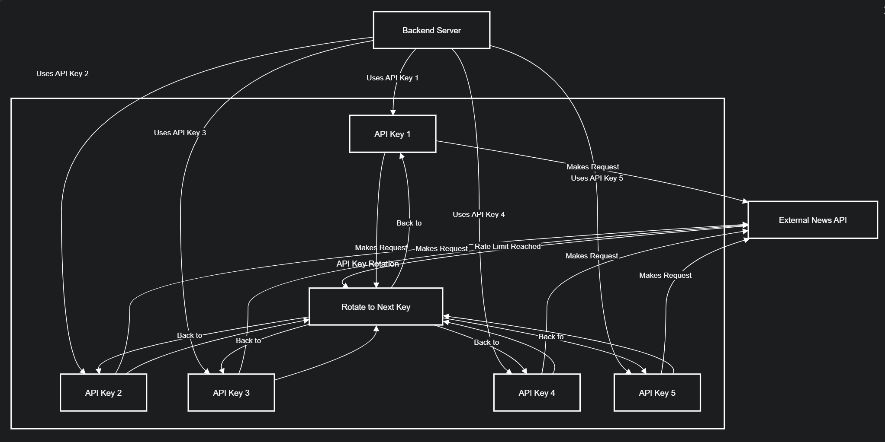
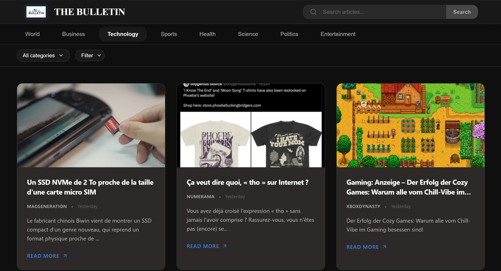
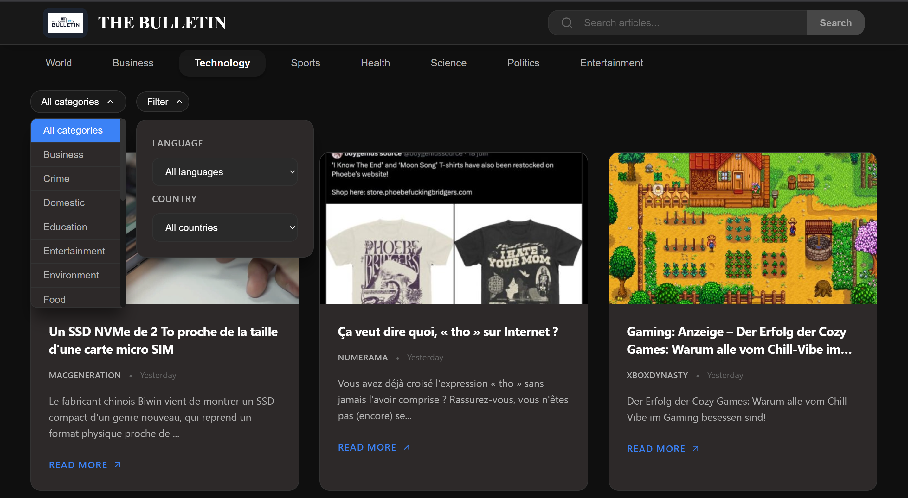
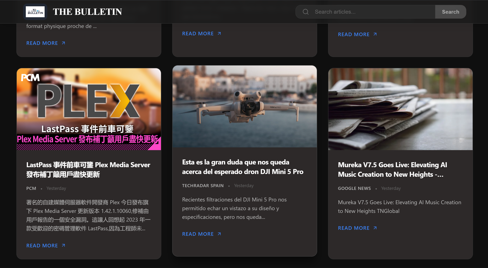

# 📰 Bulletin - News Curation Website

[](https://reactjs.org/)
[](https://nodejs.org/)
[](LICENSE)
[](https://newsdata.io/)


**Bulletin** is a modern, responsive news curation website that fetches and categorizes news from top platforms. It provides users with a clean interface to explore news across different categories like Technology, Sports, Politics, and more.  

**Live Demo:** [https://thebulletin-boh6.vercel.app](https://thebulletin-boh6.vercel.app)

---

## ⚡ Features

- **Categorized News:** Technology, Sports, Politics, and more.
- **Responsive Design:** Works seamlessly on desktop and mobile devices.
- **Fast & Lightweight:** Minimal loading time for smooth user experience.
- **API Rotation:** Ensures uninterrupted news fetching by rotating multiple API keys.
- **Language & Country Filter:** Users can filter news based on preferred language and country.

---

## 🛠 Tech Stack

- **Frontend:** React.js, Vite, CSS
- **Backend:** Node.js, Express
- **API:** newsdata.io API (with API rotation for reliability)
- **Deployment:** Render (backend), Vercel (frontend)

---

## 🔄 API Rotation

To avoid API limits and ensure uninterrupted news fetching:

1. Multiple API keys are stored in the backend.
2. Backend rotates through keys when making requests to the news API.
3. Automatic fallback ensures no request fails due to rate limiting.

**Diagram:**



---

## 🖼 Screenshots

- **Home Page:**  
  

- **Category Page:**  
  

- **News Detail:**  
  

---

## 🚀 Getting Started

### Prerequisites
- Node.js installed
- npm or yarn

### Backend Setup
```bash
cd backend
npm install
npm start
```

### Frontend Setup
```bash
cd frontend
npm install
npm run dev
```
---

### Environment Variables

Create a `.env` file in the backend folder:
```ini
API_KEYS=key1,key2,key3
PORT=5000
```
---

## 📂 Folder Structure
```text
bulletin/
├─ backend/
│  ├─ server.js
│  └─ routes/
├─ frontend/
│  ├─ src/
│  └─ vite.config.js
├─ screenshots/
└─ README.md
```

## 📌 Future Improvements

- User authentication and personalized news feeds.
- Bookmark and save favorite articles.
- Push notifications for breaking news.
- Progressive Web App (PWA) support for offline reading.


---

## 📄 License

This project is licensed under the **MIT License**.


---

## 🤝 Credits

Made with ❤️ by **Nikhil Soni** & **Tonmoy Mukherjee**


